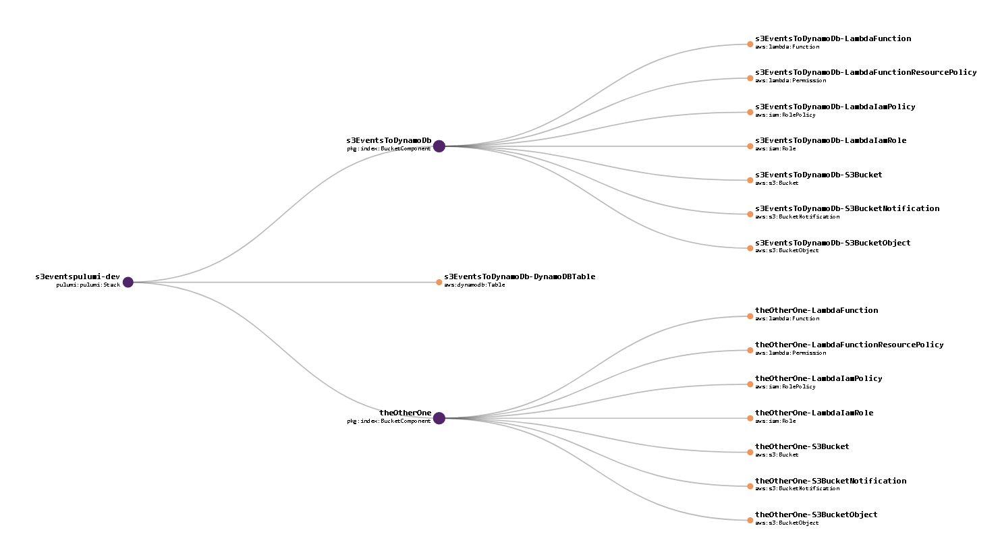

This is an example of how you can set up a Pulumi [ComponentResource](https://www.pulumi.com/docs/intro/concepts/resources/components/) as a reusable event driven pipeline using Amazon S3 and AWS Lambda, so you don't need to repeat yourself when writing Pulumi code. 

> :warning: **Proceed with caution:** You should scope down the resources and actions within the IAM policy statements. 

## Prerequistes 

1. [Configure the AWS CLI](https://docs.aws.amazon.com/cli/latest/userguide/cli-chap-configure.html) - ensure you have valid credentials 
2. [Get Started with Pulumi](https://www.pulumi.com/docs/get-started/) - install Pulumi  
3. [Create a new project](https://www.pulumi.com/docs/get-started/aws/create-project/) - this example uses TypeScript  

## Deploy and confirm deployment 

1. In your project folder, replace **`index.ts`** with the contents of **`index.ts`** in this repository. 
2. Deploy your Pulumi stack. In testing, the duration to deploy is ~34 seconds. 

```bash 
pulumi up 
```

3. In the output, you will see the resources created on your behalf. To visualize these, log in to the [Pulumi console](https://app.pulumi.com/), and select your project, stack name, the resources tab, and choose Graph View. This visualizes the resources Pulumi created on your behalf. 



You will see two ComponentResources:
- **s3EventsToDynamoDb** (a Lambda function which writes object details to a DynamoDB table)
- **theOtherOne** (a Lambda function with different permissions and Lambda function code, which prints text to its logs)

Each ComponentResource child contains:
- **Lambda function** (to run you custom code)
- **Lambda function resource policy** (to allow S3 event notifications to invoke the function)
- **Lambda IAM policy** (to access CloudWatch logs, along with resources you choose)
- **Lambda IAM role** (which has a trust policy which allows Lambda to assume the role)
- **S3 bucket** (to put objects)
- **S3 bucket notification** (to invoke the Lambda function upon object creation)
- **S3 bucket object** (to upload an object to demonstrate the initial invocation)

One of the Lambda functions requires the ability to put items into a DynamoDB table. The DynamoDB table is not required by every Lambda function, so it is not created with the S3 event pipeline ComponentResource. 
- **DynamoDBTable** (to store records of event notifications for one of the Lambda functions)

4. In the AWS management console, navigate to [DynamoDB tables](https://console.aws.amazon.com/dynamodbv2/home#tables). Select the table which Pulumi created, choose **Explore table items**, and select **Run**. You will see the S3 object created on your behalf by the Pulumi stack. This indicates the **s3EventsToDynamoDb** resources were successfully deployed, and the Lambda function was invoked with the S3 object was uploaded. 

5. In the AWS management console, navigate to [CloudWatch log groups](https://console.aws.amazon.com/cloudwatch/home#logsV2:log-groups). Select the log group for the Lambda function **theOtherOne**, then **Search all**. You will see logs which say **hello there** and **GeNeRaL kEnObI**. This indicates the **theOtherOne** resources were successfully deployed, and the Lambda function was invoked when the an S3 object was uploaded.

## Code breakdown 

1. First, you have your ComponentResource class which encapsulates the child resources listed earlier. The class's constructor function allows you to declare multiple resources at the same time. The constructor accepts arguments for the IAM policy type (described below), the Lambda code, and the environment variables. The `parent: this` option indicates the resources belongs to the ComponentResource. 

```typescript
    ////////////////////////////////////////////////////////
    // Create S3 bucket, IAM role, and IAM policy resources
    ////////////////////////////////////////////////////////
    constructor(name: string, args: { policyType: PolicyType , lambdaCode: string , environmentVariables: any }, opts?: pulumi.ComponentResourceOptions) {

        // By calling super(), we ensure any instantiation of this class
        // inherits from the ComponentResource class so we don't have to
        // declare all the same things all over again.
        super("pkg:index:BucketComponent", name, args, opts);

        this.bucket = new aws.s3.Bucket(name + "-S3Bucket", {}, { parent: this });

        this.iamRole = new aws.iam.Role(name + "-LambdaIamRole", {
            assumeRolePolicy: aws.iam.assumeRolePolicyForPrincipal({
                Service: "lambda.amazonaws.com"})
        }, { parent: this })
        
        this.iamPolicy = new aws.iam.RolePolicy(name + "-LambdaIamPolicy", {
            role: this.iamRole.id,
            policy: this.getIamPolicy(args.policyType),
        }, { parent: this });
        
        this.lambdaFunction = new aws.lambda.Function(name + "-LambdaFunction", {
            role: this.iamRole.arn,
            handler: "lambda_function.lambda_handler",
            runtime: "python3.9",
            environment: {
                variables: args.environmentVariables,
            },
            code: new pulumi.asset.AssetArchive({
                "lambda_function.py": new pulumi.asset.StringAsset(
                args.lambdaCode,
                ),
            }),
        }, { parent: this })
        
        this.allowBucket = new aws.lambda.Permission(name + "-LambdaFunctionResourcePolicy", {
            action: "lambda:InvokeFunction",
            "function": this.lambdaFunction.arn,
            principal: "s3.amazonaws.com",
            sourceArn: this.bucket.arn,
        }, { parent: this });
        
        this.bucketNotification = new aws.s3.BucketNotification(name + "-S3BucketNotification", {
            bucket: this.bucket.id,
            lambdaFunctions: [{
                lambdaFunctionArn: this.lambdaFunction.arn,
                events: ["s3:ObjectCreated:*"],
            }],
        }, {
            dependsOn: [this.allowBucket], parent: this
        });
        
        this.s3Object = new aws.s3.BucketObject(name + "-S3BucketObject", {
            key: "index.ts",
            bucket: this.bucket.id,
            source: new pulumi.asset.FileAsset("index.ts")
        }, { parent: this , dependsOn: this.bucketNotification });
        
        ///////////////////////
        // Return output to UI 
        ///////////////////////
        this.registerOutputs({
            bucketName: this.bucket.id,
            iamPolicy: this.iamPolicy.id,
            iamRole: this.iamRole.id,
            allowBucket: this.allowBucket.sourceArn,
            bucketNotification: this.bucketNotification.id,
            lambdaFunction: this.lambdaFunction.id,
            s3Object: this.s3Object.key,
        });
```

2. This script has a custom type of **PolicyType**. The custom type created in this script allows anyone reusing the class to to select a pre-determined IAM policy based on the Lambda function's required permissions. In this case, there are two IAM policies, one is for DynamoDB, the other is a SageMaker call. Note the second IAM policy is for demonstration purposes only; the policy is not actually used by the **theOtherOne** Lambda function code. 

```typescript 
    /////////////////////////////////////////////////
    // Get the IAM policy based on the provided type
    /////////////////////////////////////////////////
    private policies: { [K in PolicyType]: aws.iam.PolicyStatement } = {
        dynamodb: {
            Sid: "dynamodbTable",
            Effect: "Allow",
            Resource: "*",
            Action: [
                "dynamodb:BatchGet*",
                "dynamodb:DescribeStream",
                "dynamodb:DescribeTable",
                "dynamodb:Get*",
                "dynamodb:Query",
                "dynamodb:Scan",
                "dynamodb:BatchWrite*",
                "dynamodb:CreateTable",
                "dynamodb:Delete*",
                "dynamodb:Update*",
                "dynamodb:PutItem"
            ],
        },
        sagemaker: {
            Sid: "sagemakerRuntime",
            Effect: "Allow",
            Resource: "*",
            Action: [
                "sagemaker:CreateDataQualityJobDefinition"
            ],
        }
    };
```

3. The **getIamPolicy** method returns the IAM policy with CloudWatch logging by default, and injects the policy statement based on whether **dynamodb** or *sagemaker** policyType value is used in your variable declarations.

```typescript 
    //////////////////////////////////////////////////////////////////////
    // Return the IAM policy which includes logging to CloudWatch, always
    //////////////////////////////////////////////////////////////////////
    private getIamPolicy(policyType: PolicyType): aws.iam.PolicyDocument {
        return {
            Version: "2012-10-17",
            Statement: [{
                ...this.policies[policyType]
            },
            {
                Effect: "Allow",
                Action: "logs:CreateLogGroup",
                Resource: "arn:aws:logs:*:*:*"
            },
            {
                Effect: "Allow",
                Action: [
                    "logs:CreateLogStream",
                    "logs:PutLogEvents"
                ],
                Resource: [
                    "arn:aws:logs:*:*:log-group:/aws/lambda/*:*"
                ]
            }
            ],
        }
    };
```

4. The PolicyType custom type is declared as two values with this line.

```typescript
///////////////////////////////////////////////
// Two IAM policy options for Lambda functions
///////////////////////////////////////////////
type PolicyType = "dynamodb" | "sagemaker" ;
```

5. For **s3EventsToDynamoDb**, you need a DynamoDB table and an S3 **ComponentResource**. Not every **ComponentResource** instance requires a DynamoDB table, and so the DynamoDB table is created separately. 

```typescript 
//////////////////////////////////////////////////////////////////////
// The Lambda code needs a DynamoDB table with a unique configuration 
//////////////////////////////////////////////////////////////////////
const dynamodb = new aws.dynamodb.Table("s3EventsToDynamoDb-DynamoDBTable", {
    attributes: [
        {
            name: "x-amz-request-id",
            type: "S",
        },
        {
            name: "key",
            type: "S",
        },
        {
            name: "eventTime",
            type: "S",
        },
    ],
    billingMode: "PAY_PER_REQUEST",
    globalSecondaryIndexes: [{
        hashKey: "key",
        name: "key-eventTime-index",
        nonKeyAttributes: ["x-amz-request-id"],
        projectionType: "INCLUDE",
        rangeKey: "eventTime",
    }],
    hashKey: "x-amz-request-id",
    tags: {
        Environment: "dev",
        Name: "obj-index-table",
    },
});
```

6. You then create a new instance of the BucketComponent ComponentResource. You pass your arguments for policyType, environmentVariables, and lambdaCode. In this case, the policyType is **dynamodb**, the environmentVariables creates a Lambda function environment variable for the DynamoDB table name, and the lambdaCode value is Python 3.9 code which gets 3 values from the S3 bucket notification and puts it as an item into the DynamoDB table. 

```typescript 
/////////////////////////////////////////////////////////////////
// Create bucket with DynamoDB IAM policy type for this instance 
/////////////////////////////////////////////////////////////////
const bucket = new BucketComponent("s3EventsToDynamoDb", {
    policyType: "dynamodb",
    environmentVariables: {table: dynamodb.name,},
    lambdaCode: `import boto3
import os 

dynamodb = boto3.client('dynamodb')

def lambda_handler(event, context):
    requestId = event['Records'][0]['responseElements']['x-amz-request-id']
    key = event['Records'][0]['s3']['object']['key']
    eventTime = event['Records'][0]['eventTime']
    table = os.environ['table']
    try:
        response = dynamodb.put_item(TableName=table, Item={'x-amz-request-id':{'S':requestId},'key':{'S':key},'eventTime':{'S':eventTime}})
        return response
    except Exception as e:
        print(e)
        print('Error putting S3 request id {} with key {} at {} into DynamoDB table {}. It may have sent twice. Make sure this item exists in your table.'.format(x-amz-requst-id, key, eventTime, table))
        raise e
    return {
        'statusCode': 200, 
        'body': response 
    }`
});
```

7. To show ComponentResource reusability, the **theOtherOne** instance of the BucketComponent ComponentResource uses the **sagemaker** policyType, **foo bar** environmentVariables, and the lambdaCode prints two lines of text. 

```typescript
/////////////////////////////////////////////////////////////////
// Reusing the ComponentResource - annnd May the 4th be with you 
/////////////////////////////////////////////////////////////////
const bucket2 = new BucketComponent("theOtherOne", {
    policyType: "sagemaker",
    environmentVariables: {foo: "bar",},
    lambdaCode: `def lambda_handler(event, context):
    print("hello there")
    print("GeNeRaL kEnObI")`
});
```

8. Lastly, you can output resource values when you deploy them. A few are provided as samples, though not functionally critical in this case. 

```typescript 
///////////////////////////////////
// Export resource names to the UI 
///////////////////////////////////
export const bucketName = bucket.bucket.id;
export const bucket2Name = bucket2.bucket.id;
export const dynamoDbTableName = dynamodb.name;
```

## Notes for first timers  

1. If you want to change stacks (dev, staging, production), you can run the following command. For more information on changing stacks, refer to [Pulumi Stacks](https://www.pulumi.com/docs/intro/concepts/stack/). 

```bash
pulumi stack init production 
```

2. If you want to list your stacks, run the following command. 

```bash 
pulumi stack ls 
``` 

3. To change stacks, run the following command. 

```bash 
pulumi stack select dev 
```

4. For more information on organizing your Pulumi environment, refer to refer to [Organizing Projects and Stacks](https://www.pulumi.com/docs/guides/organizing-projects-stacks/).

## Clean up 

To delete the resources you deployed following along, simply run the following command. Use caution when running this command if you've deployed other resources using Pulumi. 

```bash 
pulumi destroy 
```

You've reached the end! Hope you've learned a thing! 